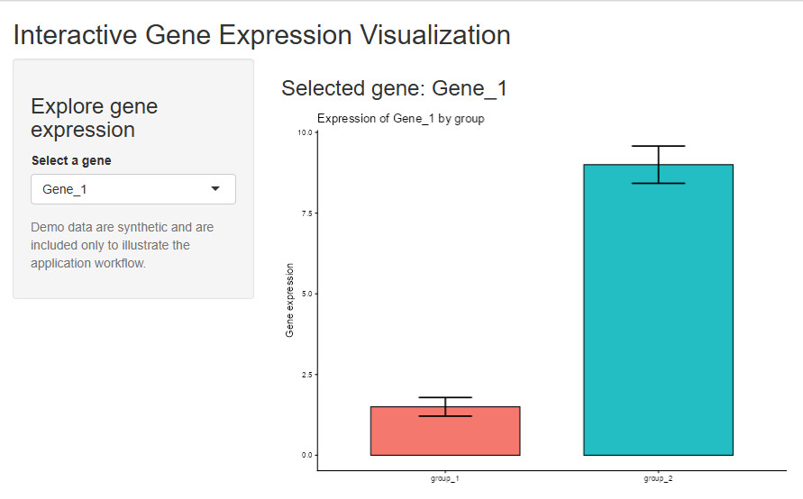

# Interactive Gene Expression Visualization with R Shiny

A lightweight R Shiny application demonstrating interactive exploration of gene-expression data. The app provides a simple user-facing interface for selecting a gene and visualizing group-level expression summaries with mean +/- standard error.

## Purpose

This repository preserves and documents a small R Shiny application I developed to demonstrate how gene-expression results can be presented through an interactive web interface rather than requiring users to edit analysis scripts or regenerate plots manually.

This is intentionally a **lightweight visualization application / demonstration**, not a full omics analysis platform. The public repository uses synthetic demonstration data and does not contain research, patient, or other confidential data.

## Features

- Interactive gene selection through a Shiny drop-down menu.
- Gene choices are generated dynamically from the loaded dataset rather than hard-coded in the application.
- Group-level expression visualization using mean values and standard-error bars.
- Separation of data preparation (`prepare_example_data.R`) and exploratory analysis (`exploratory_analysis.R`) from the Shiny application (`app.R`).
- Simple structure that can be adapted to other gene-expression datasets with the same basic schema.

## Application preview



The screenshot above shows the application running with the synthetic demonstration data included in this repository. Users can select a gene from the dynamically generated menu and view group-level mean expression with standard-error bars. No research, patient, or institutional data are shown.

## Repository structure

```text
.
|-- app.R
|-- prepare_example_data.R
|-- exploratory_analysis.R
|-- requirements.R
|-- images/
|   `-- app_screenshot.jpg
|-- data/
|   |-- gene_expression_table.csv
|   `-- mydata_long.csv
`-- README.md
```

## Example data

The files in `data/` are **synthetic/demo data created only to illustrate the application workflow**.

- `gene_expression_table.csv`: wide-format example expression matrix.
- `mydata_long.csv`: long-format table read by the Shiny application.

The demonstration contains three generic genes (`Gene_1` to `Gene_3`) and six synthetic samples divided into two groups. These values should not be interpreted as biological results.

To regenerate `mydata_long.csv` from the wide-format input, run:

```r
source("prepare_example_data.R")
```

To review selected exploratory steps retained from the original development process—including group summaries, standard errors, exploratory t-tests, and a standalone expression plot—run:

```r
source("exploratory_analysis.R")
```

The exploratory script is included for transparency and portfolio documentation; its statistical tests are demonstrations rather than a general analysis strategy.

## Requirements

The application uses:

- R
- `shiny`
- `tidyverse`

Install the required R packages with:

```r
source("requirements.R")
```

or manually:

```r
install.packages(c("shiny", "tidyverse"))
```

## How to run

1. Clone or download this repository.
2. Open R or RStudio with the repository as the working directory.
3. Install the required packages if needed.
4. Run:

```r
shiny::runApp()
```

The application will open in a local web browser or the RStudio Viewer.

## Scientific context

Interactive visualization can help researchers explore analytical results without repeatedly modifying plotting code. This small application illustrates that concept using gene-expression data: a user selects a gene, and the app dynamically displays summarized expression across sample groups.

In a research setting, the same design pattern can be extended to larger expression matrices, richer sample metadata, additional visualizations, or other omics-derived results. This repository is presented as evidence of practical R Shiny experience and of translating computational outputs into a simple, user-facing research interface; it is not intended to represent a production software platform.

## Adapting the demonstration

To adapt the app to another dataset, provide a long-format table containing at least:

- `gene_name`
- `sample`
- `expression`
- `group`

The gene-selection menu will automatically populate from the values in `gene_name`.

## Author

Jia-Hua (George) Qu, MD, PhD
